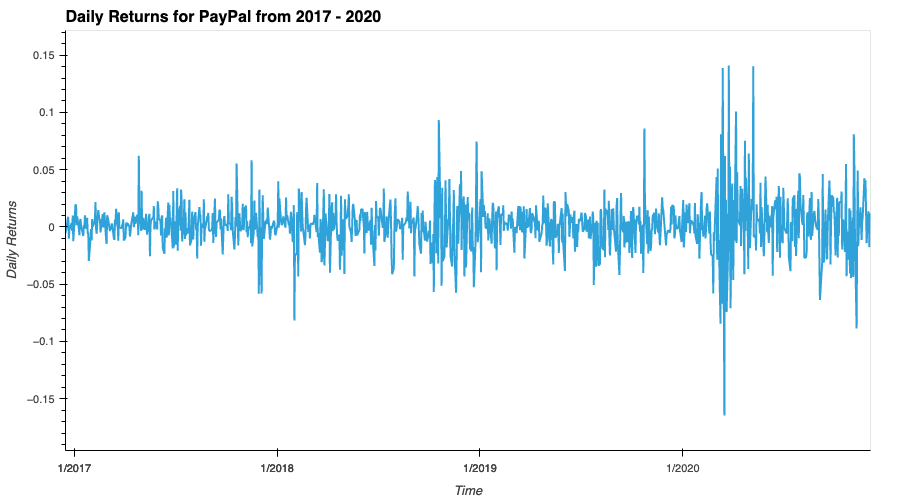
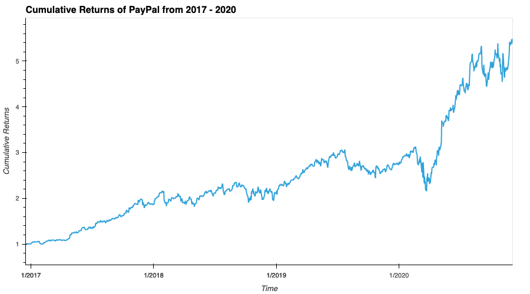
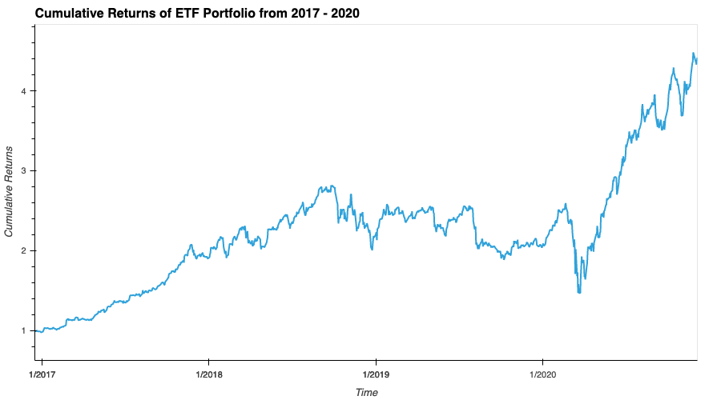

# ETF Analyzer
---
## Description
---
This application is a financial database and web application using SQL. At the end we'll use the `Voila` library to analyze the performance of the hypothetical ETF.

---
## Installations
---
This application can be done on either *VS Code* or *Jupyter Notebook*.

* We need to install [Pandas](https://pandas.pydata.org/docs/getting_started/install.html).
* Install [NumPy](https://numpy.org/install/) to use a function the library has.
* Install [PyViz ecosystem](https://pypi.org/project/hvplot/).
* Install [SQLAlchemy](https://github.com/conda-forge/sqlalchemy-feedstock).
* Install [Voila](https://github.com/conda-forge/voila-feedstock)

---
### How to install:
---
* ```python
  conda install pandas
  ```
* ```python
  conda install numpy
  ```
* ```python
  conda install -c pyviz hvplot
  ```
* ```python
  conda install sqlalchemy
  ```
* ```python
  conda install voila 
  ```
---
## Charts
---
### Daily Returns for PayPal


### Cumulative Returns of PayPal


### Cumulative Returns of ETF



---
## Contributors
---
Brought to you by Angel Reyes.
